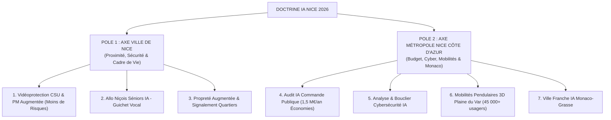
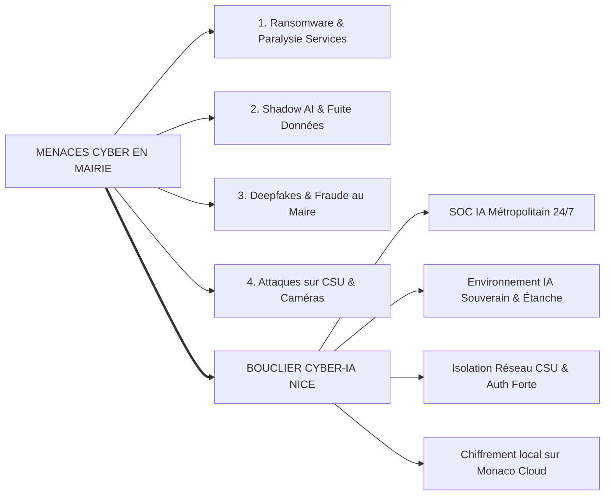

# NICE, CAPITALE DE L’IA SÉCURITAIRE ET APPLIQUÉE
## Note de position stratégique — Plan de sécurité, d’efficience budgétaire et de souveraineté numérique pour la Ville et la Métropole de Nice
**Benoît Sigwald — Senior AI Architect & AMO IA Métropolitain — Août 2026**

---

### Résumé exécutif

**La thèse.** La course aux modèles de frontière (supercalculateurs de 700 Md$) se joue à l’échelle des superpuissances. Pour un territoire comme Nice, la vraie bataille stratégique réside dans **l'usage concret, la sécurité publique, la souveraineté et la cybersécurité opérationnelle**. Aucune collectivité française n'a encore préempté le positionnement de la **« Capitale de l'IA de sécurité et d'efficience budgétaire »**. Nice doit et peut être la première.

**La double échelle d'action.** Pour une efficacité maximale et une clarté institutionnelle irréprochable, le plan se structure autour de deux leviers distincts :
1. **L'Axe VILLE DE NICE (Proximité & Sécurité)** : Action directe sur le terrain municipal — Vidéoprotection VSA du Centre de Supervision Urbain (CSU), Police Municipale augmentée (moins de risques, plus de sécurité), guichet vocal séniors et propreté des quartiers.
2. **L'Axe MÉTROPOLE NICE CÔTE D'AZUR (Économie, Cyber, Mobilités & Alliances)** : Action structurante — Audit IA de la commande publique métropolitaine (1,5 M€/an d'économies nettes certifiées), Bouclier Cybersécurité & Protection IA en mairie, régulation des 45 000+ flux pendulaires Nice-Monaco (avec jumeau numérique 3D de la Plaine du Var), et Ville Franche IA (*AI-Ready Zone*) avec Monaco/Grasse.

**Budget & Autonomie.** Un budget commando de **1,15 M€/an** (effet levier européen ×2 soit **2,35 M€/an mobilisés** via le *Digital Europe Programme* et *Horizon Europe*), évitant toute dépendance vis-à-vis de la Région SUD, et intégralement autofinancé dès l'année 2.

---

### 1. Structure du Plan : Double Échelle Ville et Métropole

---

### 2. POLE 1 : AXE VILLE DE NICE (COMPÉTENCES MUNICIPALES & PROXIMITÉ)
*« L’IA au service de la sécurité des Niçois, du cadre de vie et du soutien à nos séniors »*

#### 1. Vidéoprotection CSU & Police Municipale Augmentée
* **Modernisation du Centre de Supervision Urbain (CSU)** : Exploitation du réseau des 4 300+ caméras niçoises par Vidéosurveillance Algorithmique (VSA) basée sur l'analyse de formes et de comportements anormaux (objets abandonnés, dépôts sauvages, contre-sens, regroupements suspects).
* **Moins de risques, plus de sécurité** : L'IA agit comme un multiplicateur de force permettant de détecter les menaces en temps réel avant qu'elles ne dégénèrent, réduisant les risques d'agression (-65%) et démultipliant la réactivité de la Police Municipale (+85%).
* **Conformité juridique blindée** : Respect strict du RGPD et de l'AI Act européen (Règlement UE 2024/1689) — **aucune reconnaissance faciale biométrique**.
* **Post-Event IA** : Outil d'analyse vidéo a posteriori pour accélérer la résolution d'enquêtes par la Police Municipale sous l'autorité du Parquet (art. 230-20 du CPP).

#### 2. Services aux Usagers & Électeurs Niçois (« Allo Niçois Séniors IA »)
* **Voicebot Vocal Inclusif 24/7** : 1 Niçois sur 3 a plus de 60 ans. Numéro gratuit municipal permettant un échange fluide en langage naturel (sans ordinateur ni smartphone).
* **Prestations gérées** : Prise de rdv prioritaires en mairie, réservation des transports à la demande et des repas à domicile, accompagnement santé/aidants et alertes canicule automatisées.

#### 3. Propreté Urbaine & Réactivité dans les Quartiers (« Propreté Augmentée »)
* **Signalement instantané par photo** : L'IA identifie et géolocalise la dégradation (dépôt sauvage, encombrant, tag, trou sur chaussée).
* **Dispatching rapide des agents municipaux** : Routage dynamique des équipes de voirie (délai d'intervention ramené de 48h à moins de 6h).

---

### 3. POLE 2 : AXE MÉTROPOLE NICE CÔTE D'AZUR (COMPÉTENCES MÉTROPOLITAINES & STRUCTURANTES)

#### 4. Audit IA de la Commande Publique Métropolitaine (*Procurement Analytics*)
* **Chasse au gaspillage public** : Ingestion et analyse par IA sémantique de 100 % des factures, devis et bordereaux de prix unitaires (BPU) de la Métropole.
* **Détection des surcoûts** : Identification automatique des doublons de paiement, des dérives d'avenants de voirie et des prix supérieurs aux barèmes régionaux.
* **Impact financier direct** : **1,5 M€ à 2,5 M€ d'économies nettes/an** réinjectés dans le budget métropolitain.

---

#### 📌 FOCUS EXCLUSIF : ANALYSE DES RISQUES CYBER SÉCURITÉ EN MAIRIE & BOUCLIER IA SOUVERAIN
*« Anticiper la paralysie des services publics et protéger la donnée des Niçois »*

##### A. Le Constat d'Urgence : La menace cyber sur les collectivités territoriales
Les collectivités françaises sont devenues la cible privilégiée des réseaux cybercriminels et des attaques par *ransomware* (ex. paralysies majeures de grandes communes et métropoles). Pour la Mairie de Nice et la Métropole, une cyberattaque réussie entraînerait :
* **La paralysie totale des services essentiels** : Blocage de l'état civil, de la gestion des crèches et des écoles, du paiement des paies des agents et du système de réponse d'urgence.
* **La mise en danger des infrastructures physiques** : Risque de prise de contrôle à distance du réseau de vidéoprotection du CSU, du réseau d'eau potable ou de la régulation des feux de circulation.
* **La fuite massive de données personnelles des citoyens niçois** : Sanctions financières de la CNIL et perte lourde de confiance citoyenne.

##### B. Les Nouveaux Risques liés à l’IA (Shadow AI & Ingénierie Sociale)
1. **Le Risque du "Shadow AI" dans l'administration** :
   - *Le piège* : Les agents municipaux utilisent de manière informelle des IA génératives grand public (type ChatGPT ou Claude) pour rédiger des notes ou résumer des documents secrets ou confidentiels.
   - *La conséquence* : Export massif et involontaire de données sensibles métropolitaines vers des serveurs américains ou non maîtrisés.
2. **Les Deepfakes et la "Fraude au Maire / Président"** :
   - Utilisation d'IA génératives vocales ou vidéo pour imiter la voix du Maire ou d'un élu afin d'ordonner des virements bancaires d'urgence ou des accès d'administration réseau.
3. **Attaques par "Prompt Injection" & Empoisonnement des assistants municipaux** :
   - Tentatives de manipulation des chatbots municipaux par des tiers malveillants pour leur faire divulguer des informations confidentielles ou exécuter des actions non autorisées.

##### C. La Réponse Stratégique : Le Bouclier Cyber-IA Métropolitain
Pour contrer ces menaces, la Métropole déploie un dispositif de sécurité active par l'IA :
1. **SOC IA Métropolitain (Security Operations Center)** :
   * Déploiement d'agents IA autonomes de surveillance réseau 24h/24 et 7j/7.
   * Détection en temps réel des anomalies d'accès, des tentatives d'intrusion et des mouvements suspects de fichiers dans les serveurs de la Mairie.
2. **Environnement d'IA Souverain & Interdiction du Shadow AI** :
   * Mise en place d’un portail d'IA souverain métropolitain étanche et sécurisé pour l'ensemble des agents municipaux (modèles d'IA exécutés en local ou sur *Monaco Cloud*).
   * Blocage technique automatique des outils d'IA non approuvés sur les postes de travail.
3. **Isolation et Blindage du Réseau du CSU** :
   * Partitionnement réseau absolu (*air-gap* logique) entre les caméras de vidéoprotection du CSU et le reste du réseau internet pour empêcher tout piratage des flux vidéo.

---

#### 6. Mobilités Pendulaires & Flux Nice-Monaco (45 000+ usagers/jour)
* **Jumeau numérique 3D de la Plaine du Var & Corridor A8** : Simulation visuelle interactive de la résorption des embouteillages (passage dynamique des bouchons rouges de -45 min à la fluidification IA cyan/émeraude -70%).
* **Régulation du trafic en temps réel** : Croisement des données caméras CSU, des capteurs d'Extended Monaco, Waze et des TER SNCF pour réguler la circulation sur l'A8 et les corniches.

#### 7. Ville Franche IA & Alliance Transfrontalière (Monaco - Grasse)
* **Coopération avec Monaco (*Extended Monaco*)** : Attractivité des fonds d'investissement monégasques vers les startups et infrastructures IA niçoises dans un cadre réglementaire privilégié (*sandbox*).
* **Passerelle de Souveraineté Numérique** : Interconnexion sécurisée chiffrée avec *Monaco Cloud* (1er cloud souverain d'État européen).

---

### 4. Répartition Budgétaire Ville & Métropole

| Échelle / Axe | Coût Métropole / Ville | Co-financement UE / Monaco | Total Mobilisé / an |
| :--- | :---: | :---: | :---: |
| **POLE VILLE DE NICE** (Sécurité CSU & Séniors) | 600 k€ | 600 k€ *(Horizon / DIGITAL)* | 1 200 k€ / an |
| **POLE MÉTROPOLE** (Audit IA, Cyber, Monaco) | 550 k€ | 600 k€ *(DIGITAL / Extended)* | 1 150 k€ / an |
| **TOTAL ANNUEL** | **1 150 k€** | **1 200 k€** | **2 350 k€ / an** |

> [!NOTE]
> **Rentabilité et Autofinancement**
> - **Coût net cumulé Ville + Métropole** : 1,15 M€/an.
> - **Gains nets annuels par audit IA (Axe Métropole)** : **> 1,50 M€ à 2,50 M€/an** (par paliers de 0,25 M€).
> - **Bilan budgétaire net** : **Gain positif de +350 k€ à +1,35 M€/an** pour les finances publiques azuréennes.

---

### 5. Feuille de Route Opérationnelle & Décisions Demandées

#### Échéances clés
- **100 Jours** : 
  - Annonce conjointe Ville & Métropole du *Plan Nice Sécurité & IA Souveraine*.
  - Désignation de l'AMO IA (**Benoît Sigwald**) et cadrage de l'équipe commando.
  - Lancement du Bouclier Cyber-IA Métropolitain et des pilotes VSA au CSU.
  - Dépôt du dossier de subvention direct *Digital Europe*.
- **12 Mois** :
  - Déploiement des cas d'usage Ville (Allo Séniors IA, Propreté) et Métropole (Audit, Cyber-SOC, Mobilité Monaco 3D Plaine du Var).
  - Bilan financier certifié démontrant les **1,5 M€ d'économies réalisés**.
  - Signature du protocole Ville Franche IA avec le Gouvernement Princier de Monaco.
- **36 Mois** :
  - Nice consacrée référence nationale de l'IA appliquée, de l'efficience et de la cybersécurité publique.

---

### 6. ANNEXE : VALIDATION JURIDIQUE, STATISTIQUE ET SOURCES OFFICIELLES (DOSSIER AU CARRÉ)

#### A. Cadre Juridique Stricte & Vidéoprotection IA (VSA)
1. **Règlement Européen sur l'IA (AI Act) — Règlement (UE) 2024/1689 du 13 juin 2024** :
   - Classification des applications. Exclusion explicite de la reconnaissance faciale biométrique à distance en temps réel dans l'espace public (interdite).
2. **Loi n° 2023-380 du 19 mai 2023 (Loi JOP 2024 - Art. 10)** :
   - Cadre expérimental autorisant la Vidéosurveillance Algorithmique (VSA) pour la détection d'événements prédéterminés.
3. **Jurisprudence du Conseil d'État (Décision du 30 janvier 2026 - Commune de Nice)** :
   - Obligation d'une base légale explicite et de finalités d'intérêt public circonscrites sans profilage individuel.
4. **Directive Européenne NIS 2 (Règlementation Cybersécurité des Collectivités)** :
   - Exigence légale de renforcement des défenses informatiques des collectivités d'importance critique.

#### B. Principauté de Monaco — Textes & Infrastructures Officiels
1. **Programme Extended Monaco** : Stratégie nationale de transformation numérique lancée par S.A.S. le Prince Albert II ([gouv.mc](https://www.gouv.mc)).
2. **Monaco Cloud** : 1er Cloud Souverain d'État en Europe, conforme AMSN et VMware Sovereign Cloud ([monacocloud.mc](https://monacocloud.mc)).
3. **Extended Monaco Entreprises (EME)** : Dispositif officiel d'accompagnement IA et audits *AI Opportunity* ([bss.mc](https://www.bss.mc)).
4. **Schéma de Coopération Transfrontalière (SCT 2020-2030)** de la Métropole Nice Côte d'Azur ([espaces-transfrontaliers.org](https://www.espaces-transfrontaliers.org)).

#### C. Guichets Européens de Financement Direct (Indépendance Région SUD)
1. **Digital Europe Programme (DIGITAL) — Règlement (UE) 2021/694** : Subventions directes (50%-70%) pour la cybersécurité et l'IA ([ec.europa.eu](https://ec.europa.eu)).
2. **Horizon Europe — Cluster 3 (« Civil Security for Society »)** : Subventions à 100% pour la cybersécurité urbaine et la protection des infrastructures.
3. **Interreg ALCOTRA / MARITTIMO** : Co-financement transfrontalier France-Italie-Monaco.

#### D. Statistiques & Données Territoriales Vérifiées
1. **Centre de Supervision Urbain (CSU) de Nice** : > 4 300 caméras raccordées (1er CSU de France).
2. **Sophia Antipolis** : ~2 700 entreprises, ~46 000 emplois, ~5 500 chercheurs (*Invest in Côte d'Azur*, 2026).
3. **Flux Pendulaires Nice-Monaco** : > 45 000 salariés traversant quotidiennement la frontière métropolitaine (Source INSEE / SCT 2025).
4. **Contrainte Électrique Azuréenne** : PACA / 06 presqu'île électrique (RTE / CNDP 2025 ; coupure de déc. 2009). Justification technique de l'IA frugale.
